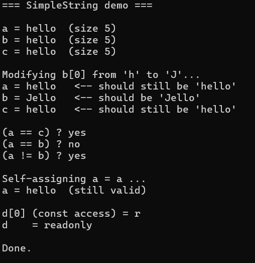
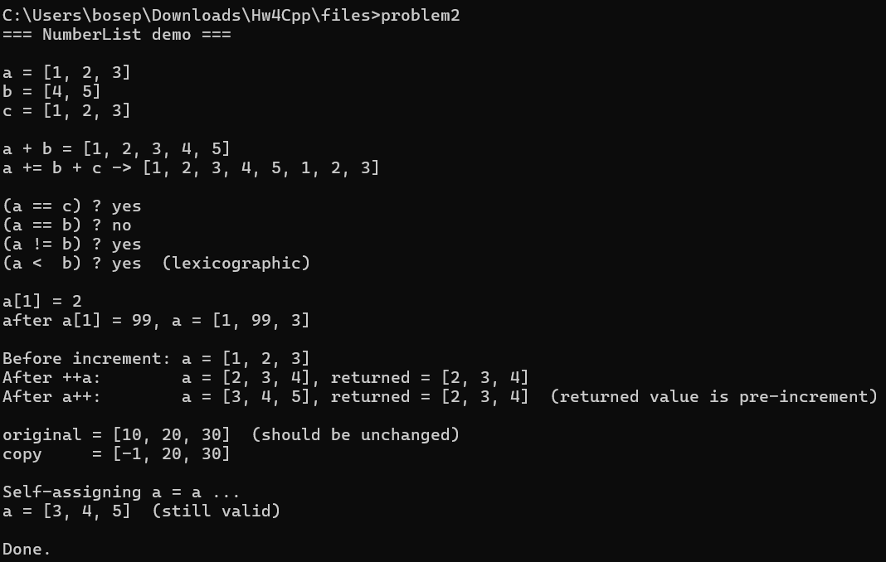
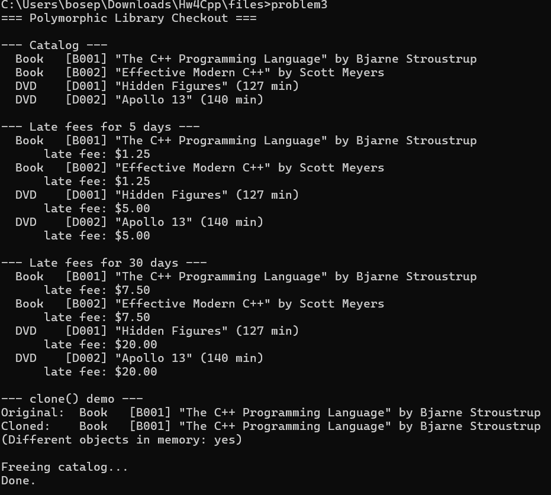
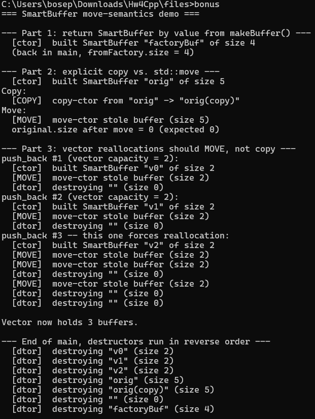

# cpp-homework-4

**Name:** Joseph
**Course:** EE 5102 / EE 4953 — Engineering Programming
**Assignment:** Homework 4 — Copy Control, Operator Overloading, and Object-Oriented Programming

This directory contains my solutions for HW4. Each problem lives in its own
`.cpp` file and can be compiled independently. All programs were tested with
`g++ -std=c++11 -Wall -Wextra -Wpedantic` and compile with no warnings.

## Files

| File          | Description |
|---------------|-------------|
| `problem1.cpp` | `SimpleString` — value-like class managing a `char*` buffer. Implements the Rule of Three with copy-and-swap, plus `[]`, `==`/`!=`, and `<<`. |
| `problem2.cpp` | `NumberList` — dynamic int container with overloaded `+`, `+=`, `==`, `<`, `[]`, prefix/postfix `++`, and `<<`. |
| `problem3.cpp` | Polymorphic `LibraryItem` hierarchy with `Book` and `DVD` derived classes. Uses pure virtual `lateFee()` and `clone()`, virtual destructor, `std::vector<LibraryItem*>`, dynamic binding, slicing prevention. |
| `bonus.cpp`    | `SmartBuffer` — full Rule of Five with verbose copy/move tracing. Demonstrates return-by-value, explicit `std::move`, and vector reallocation choosing moves over copies. |

## Solution summaries

### Problem 1 — `SimpleString`
- Stores characters in a `char*` buffer with `size_t size_`. Default constructor allocates a 1-byte buffer holding `'\0'` so `data_` is never null — keeps the rest of the code branch-free.
- Constructor from `const char*` does its own allocation and `strcpy`, never aliasing the caller's pointer.
- Copy constructor does a deep copy.
- Copy-assignment uses **copy-and-swap** — takes the parameter by value (which constructs a copy), swaps internals, and lets the temporary clean up the old buffer when it goes out of scope. Self-assignment-safe and exception-safe for free.
- `operator[]` has both `const` and non-`const` overloads.
- `operator<<`, `operator==`, `operator!=` are implemented as friends.
- The driver demonstrates that mutating `b[0]` does **not** affect the source `a` it was copied from, proving deep-copy semantics.

### Problem 2 — `NumberList`
- Stores ints in a dynamically allocated array. Manages its own memory with `new[]`/`delete[]`.
- Rule of Three: copy ctor, copy-assign (with self-assign guard), and destructor.
- `operator+` is implemented in terms of `operator+=` so the concatenation logic only lives in one place. The lhs is taken by value to avoid manual buffer juggling.
- `operator<` does a lexicographic comparison (matches what `std::vector<int>` would do).
- Prefix `++` returns a reference to `*this`; postfix `++` takes the dummy `int` parameter, returns the old value.
- Driver shows operator chaining (`a += b + c`), self-assignment safety, deep-copy independence, and that postfix `++` returns the pre-increment value while prefix returns the post-increment value.

### Problem 3 — `LibraryItem` / `Book` / `DVD`
- `LibraryItem` is abstract (pure virtual `lateFee` and `clone`) with a virtual destructor.
- `Book` charges $0.25/day flat. `DVD` charges $1.00/day capped at $20.00.
- `operator<<` is a free function that calls a virtual `print()` member — that's how you get polymorphic stream output (`operator<<` itself can't be virtual).
- The catalog is `std::vector<LibraryItem*>` — pointers, not values, so derived parts don't get sliced off.
- `clone()` lets you make a deep copy through a base-class pointer without knowing the runtime type.
- All `new`'d items are `delete`'d at the end. Because the destructor is virtual, the right derived dtor runs.

### Bonus — `SmartBuffer`
- Full Rule of Five with verbose tracing on every operation.
- Move ctor and move-assignment are marked `noexcept` — this is what allows `std::vector` to pick the move path during reallocation. Without `noexcept`, the vector would fall back to copying for exception-safety reasons (the strong guarantee).
- Moved-from objects have `data_ = nullptr` and `size_ = 0`, so the destructor still runs cleanly later.
- The demo:
  1. Returns a `SmartBuffer` by value from `makeBuffer()` — NRVO elides the move on most compilers, so you'll see just one ctor message.
  2. Explicit copy vs. `std::move` — clearly shows `[COPY]` vs. `[MOVE]` lines.
  3. Reserves a vector with capacity 2, then forces a reallocation by pushing a 3rd element. You can see the existing 2 elements get **moved**, not copied, into the new buffer.

## Building & running

Compile any program with:

```bash
g++ -std=c++11 -Wall -Wextra -Wpedantic -o <output> <source>.cpp
```

### Problem 1
```bash
g++ -std=c++11 -Wall -Wextra -Wpedantic -o problem1 problem1.cpp
./problem1
```

### Problem 2
```bash
g++ -std=c++11 -Wall -Wextra -Wpedantic -o problem2 problem2.cpp
./problem2
```

### Problem 3
```bash
g++ -std=c++11 -Wall -Wextra -Wpedantic -o problem3 problem3.cpp
./problem3
```

### Bonus
```bash
g++ -std=c++11 -Wall -Wextra -Wpedantic -o bonus bonus.cpp
./bonus
```

> On Windows / PowerShell, replace `./problem1` with `.\problem1.exe`.

## Sample output

### Problem 1
```
=== SimpleString demo ===

a = hello  (size 5)
b = hello  (size 5)
c = hello  (size 5)

Modifying b[0] from 'h' to 'J'...
a = hello   <-- should still be 'hello'
b = Jello   <-- should be 'Jello'
c = hello   <-- should still be 'hello'

(a == c) ? yes
(a == b) ? no
(a != b) ? yes

Self-assigning a = a ...
a = hello  (still valid)

d[0] (const access) = r
d    = readonly

Done.
```


### Problem 2
```
=== NumberList demo ===

a = [1, 2, 3]
b = [4, 5]
c = [1, 2, 3]

a + b = [1, 2, 3, 4, 5]
a += b + c -> [1, 2, 3, 4, 5, 1, 2, 3]

(a == c) ? yes
(a == b) ? no
(a != b) ? yes
(a <  b) ? yes  (lexicographic)

a[1] = 2
after a[1] = 99, a = [1, 99, 3]

Before increment: a = [1, 2, 3]
After ++a:        a = [2, 3, 4], returned = [2, 3, 4]
After a++:        a = [3, 4, 5], returned = [2, 3, 4]  (returned value is pre-increment)

original = [10, 20, 30]  (should be unchanged)
copy     = [-1, 20, 30]

Self-assigning a = a ...
a = [3, 4, 5]  (still valid)

Done.
```


### Problem 3
```
=== Polymorphic Library Checkout ===

--- Catalog ---
  Book   [B001] "The C++ Programming Language" by Bjarne Stroustrup
  Book   [B002] "Effective Modern C++" by Scott Meyers
  DVD    [D001] "Hidden Figures" (127 min)
  DVD    [D002] "Apollo 13" (140 min)

--- Late fees for 5 days ---
  Book   [B001] "The C++ Programming Language" by Bjarne Stroustrup
      late fee: $1.25
  ...
  DVD    [D001] "Hidden Figures" (127 min)
      late fee: $5.00

--- Late fees for 30 days ---
  Book   [B001] "The C++ Programming Language" by Bjarne Stroustrup
      late fee: $7.50
  ...
  DVD    [D001] "Hidden Figures" (127 min)
      late fee: $20.00     <-- cap kicks in

--- clone() demo ---
Original:  Book   [B001] "The C++ Programming Language" by Bjarne Stroustrup
Cloned:    Book   [B001] "The C++ Programming Language" by Bjarne Stroustrup
(Different objects in memory: yes)

Freeing catalog...
Done.
```


### Bonus
```
=== SmartBuffer move-semantics demo ===

--- Part 1: return SmartBuffer by value from makeBuffer() ---
  [ctor]  built SmartBuffer "factoryBuf" of size 4
  (back in main, fromFactory.size = 4)

--- Part 2: explicit copy vs. std::move ---
  [ctor]  built SmartBuffer "orig" of size 5
Copy:
  [COPY]  copy-ctor from "orig" -> "orig(copy)"
Move:
  [MOVE]  move-ctor stole buffer (size 5)
  original.size after move = 0 (expected 0)

--- Part 3: vector reallocations should MOVE, not copy ---
push_back #1 (vector capacity = 2):
  [ctor]  built SmartBuffer "v0" of size 2
  [MOVE]  move-ctor stole buffer (size 2)
  [dtor]  destroying "" (size 0)
... (similar for v1, v2)
push_back #3 -- this one forces reallocation:
  [ctor]  built SmartBuffer "v2" of size 2
  [MOVE]  move-ctor stole buffer (size 2)
  [MOVE]  move-ctor stole buffer (size 2)   <-- existing v0 moved to new buffer
  [dtor]  destroying "" (size 0)
  [MOVE]  move-ctor stole buffer (size 2)   <-- existing v1 moved to new buffer
  ...
```


## Notes
- All programs avoid global variables, follow C++11 syntax, and use `std::` prefixes (no `using namespace std;`).
- Resource ownership: any class that allocates with `new[]` releases with `delete[]` in its destructor. Copy operations always do a deep copy. Move operations (bonus) leave the source in a valid, destructible state with `data_ = nullptr`.
- No memory leaks — verified by inspection. The `Problem 3` driver explicitly `delete`s every `new`'d item before exit, and the destructors in Problems 1, 2, and the bonus are exercised by the test driver.
